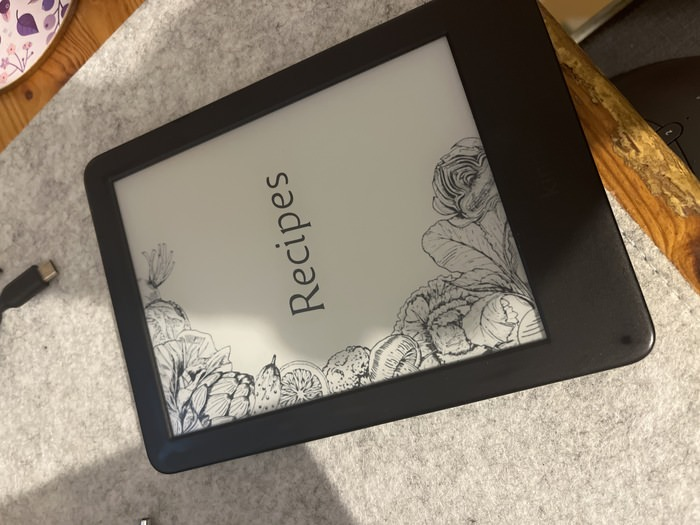

# Scripts to convert from a [Paprika](https://www.paprikaapp.com) export to an epub

I recently upgraded from a basic Kindle (2020 model) to a 2021 Kindle Paperwhite. Initially I was going to upgrade to the new base model for the higher resolution, but for "just" a little more I could get a Paperwhite and get something better:

- Larger screen;
- Same high resolution;
- Warm light.

I was left with the question of what to do with my old Kindle: it is still perfectly functional, but my partner has her own. If a Kindle was (easily) hackable I'd use it as calendar, funny screen or something, but 🤷. Next best solution: recipe book for the kitchen.

Aside from digital cookbooks I have (and a ton of paper books), most of the recipes I collect are stored in my Paprika database (and Instagram, but those are harder to pull out). Paprika offers two export modes, a "paprikarecipe" JSON-ish format and plain ol' HTML.

The scripts here (which have hardcoded path for the Paprika dump in the `makefile`) create an `epub` out of the HTML using [pandoc](https://www.paprikaapp.com). It tweaks a bit the CSS, adds title and cover. To bring it to a Kindle you'll need to use [Calibre](https://calibre-ebook.com).

After tweaking the path for the Paprika export, just run (you need `gmake`, too):

```
gmake book
```



### Pending tasks

- [ ] There are some broken _itemprop_ tags leftover from the Markdown conversion. Recipes are readable but a bit ugly.
- [ ] Styling is not ideal: ingredients should be closer together. This can be tweaked with some `awk`.

